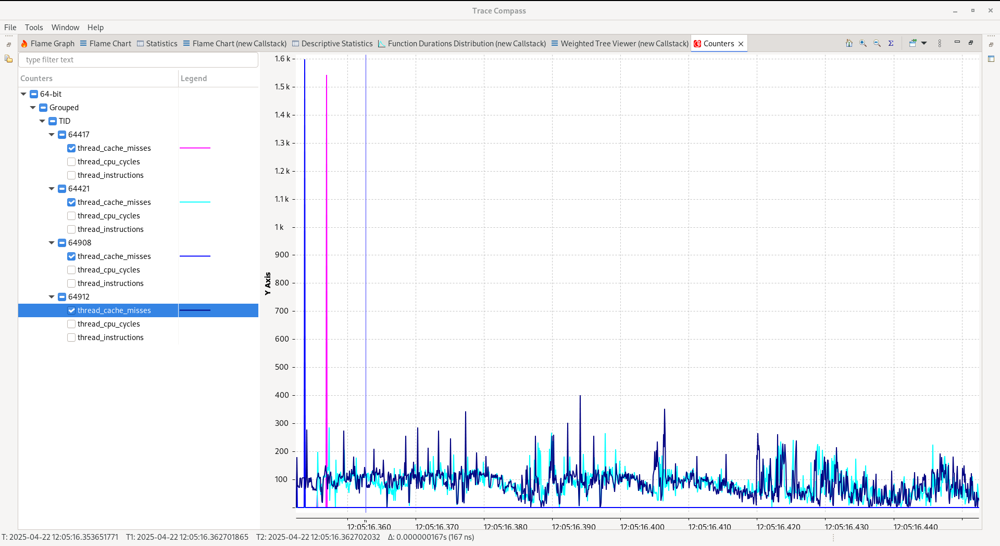
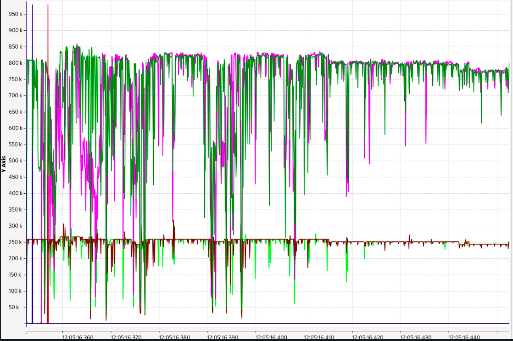
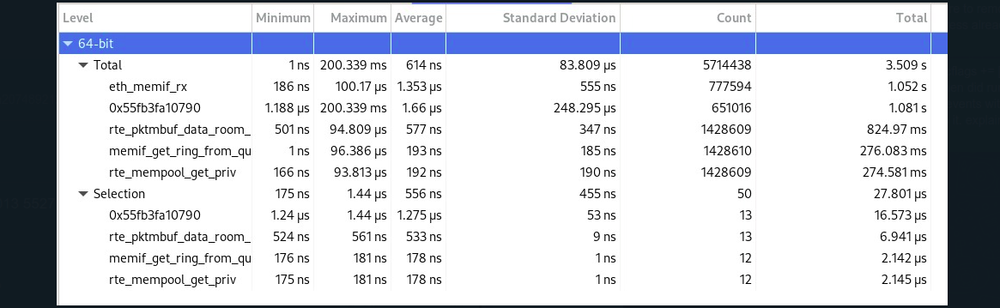
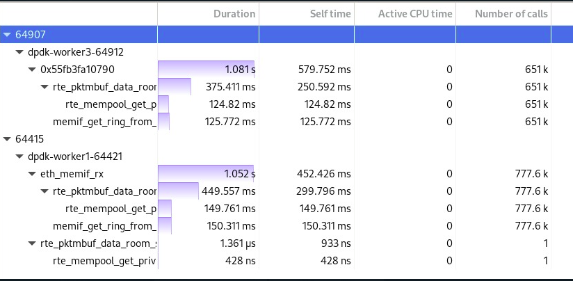
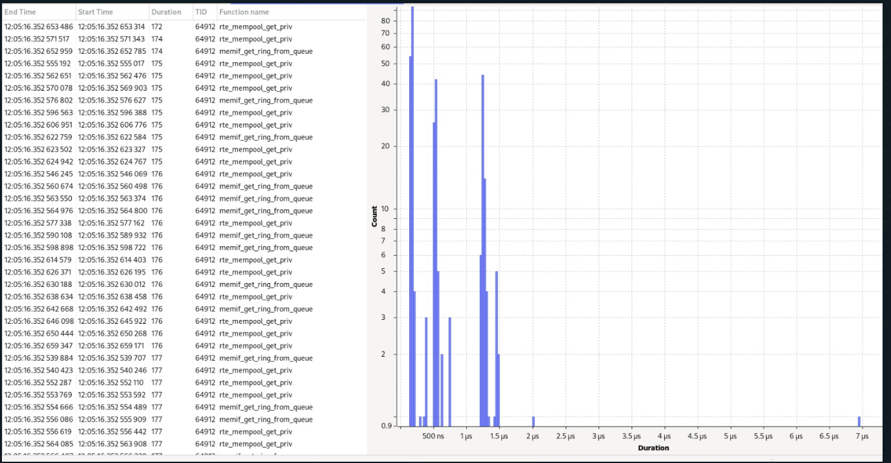
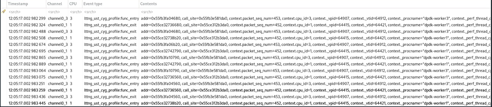

## Introduction

The Data Plane Development Kit (DPDK) is an open-source set of libraries and drivers for fast packet processing, primarily designed to run on x86, ARM, and PowerPC processors. DPDK bypasses the Linux kernel network stack to enable high-performance packet processing in user space, making it ideal for:

* High-speed network packet processing
* Network function virtualization (NFV)
* Software-defined networking (SDN) solutions
* Router, switch, and gateway implementations
* Traffic monitoring and analysis tools

## 1. DPDK Installation Roadmap

### 1.1. System Requirements

Before installing DPDK, ensure your system meets the following requirements:

1. OS: Linux (Ubuntu, CentOS, Fedora, etc.)
2. CPU: x86, ARM, or PowerPC (with supported NICs)
3. Memory: HugePages configured (recommended for performance)
4. NIC: DPDK-supported network interface card (Intel, Mellanox, Broadcom, etc.)

Prerequisites:

1. gcc or clang
2. make
3. python3 (for some scripts)
4. libnuma-dev (for NUMA support)

### 1.2. Installation Steps

Step 1: Install Dependencies
On Ubuntu/Debian:

```bash
sudo apt update
sudo apt install -y build-essential meson ninja-build python3-pyelftools libnuma-dev pkg-config
```

Step 2: Download DPDK
Get the latest stable release from the DPDK website or clone from GitHub:

```bash
wget https://fast.dpdk.org/rel/dpdk-<version>.tar.xz
tar xf dpdk-<version>.tar.xz
cd dpdk-<version>
```

Step 3: Build and Install DPDK
1.Configure the build:

```bash
meson setup build
```

2.Compile DPDK:

```bash
ninja -C build
```

3.Install DPDK libraries and tools:

```bash
sudo ninja -C build install
sudo ldconfig
```

Step 4: Configure HugePages (Optional but Recommended)
1.Check current HugePages:

```bash
grep Huge /proc/meminfo
```

2.Reserve HugePages (e.g., 1024 x 2MB pages):

```bash
echo 1024 | sudo tree /sys/kernel/mm/hugepages/hugepages-2048kB/nr_hugepages
```

3.Mount HugePages:

```bash
sudo mkdir -p /dev/hugepages
sudo mount -t hugetlbfs nodev /dev/hugepages
```

Step 6: Verify Installation
Run a test application to confirm DPDK works:

```bash
sudo ./build/app/dpdk-testpmd -l 0-3 -- -i
```

(Press start to begin packet forwarding.)

## 2. Adding -finstrument-functions to DPDK Build

### 2.1. Purpose

This document explains how and why to add the -finstrument-functions compiler flag to DPDK’s lib/ and drivers/ components. This flag enables function call instrumentation, which helps in debugging and performance analysis by logging every function entry and exit.

### 2.2. Changes Made

The following files were modified to include the flag:

1. dpdk/lib/meson.build

    ```build
    default_cflags += ['-finstrument-functions']
    ```

2. dpdk/drivers/meson.build

    ```build
    default_cflags += ['-finstrument-functions']
    ```

### 2.3. Build Memif

1. build

    ```bash
    cd dpdk-main
    meson setup build
    ```

2. Compile DPDK:

    ```bash
    ninja -C build
    ```

### 2.4. What This Does

1. Compiler-Level Instrumentation
The -finstrument-functions flag instructs GCC/Clang to:

    * Insert `__cyg_profile_func_enter()` at the start of every function.

    * Insert `__cyg_profile_func_exit()` at the end of every function.

2. Expected Behavior
    * All functions in DPDK libraries and drivers will now generate call traces.

    * Requires custom implementation of the profiling hooks (see below).

    * Introduces runtime overhead (use only for debugging, not production).

3. Use Cases
    * Debugging crashes – Trace which functions executed before a failure.

    * Performance profiling – Measure time spent in critical paths.

    * Call graph analysis – Understand DPDK’s internal execution flow.

## 3. LTTng Tracing for DPDK testpmd with memif 2-way Traffic

### 3.1. Introduction

This document explains how to use LTTng (Linux Trace Toolkit next generation) to trace userspace events in a DPDK testpmd application with memif 2-way traffic. LTTng provides low-overhead tracing capabilities that help analyze performance, identify bottlenecks, and debug issues in real-time packet processing scenarios.

### 3.2. Memif Poll Mode Driver

Shared memory packet interface (memif) PMD allows for DPDK and any other client using memif (DPDK, VPP, libmemif) to communicate using shared memory. Memif is Linux only.

The created device transmits packets in a raw format. It can be used with Ethernet mode, IP mode, or Punt/Inject. At this moment, only Ethernet mode is supported in DPDK memif implementation.

#### 3.2.1. Example: testpmd

In this example we run two instances of testpmd application and transmit packets over memif.

1. First create server interface:

    ```bash
    ./<build_dir>/app/dpdk-testpmd -l 0-1 --proc-type=primary --file-prefix=pmd1 --vdev=net_memif,role=server -- -i
    ```

2. Now create client interface (server must be already running so the **client** will connect):

    ```bash
    ./<build_dir>/app/dpdk-testpmd -l 2-3 --proc-type=primary --file-prefix=pmd2 --vdev=net_memif -- -i
    ```

3. You can also enable **zero-copy** on **client** interface:

    ```bash
    ./<build_dir>/app/dpdk-testpmd -l 2-3 --proc-type=primary --file-prefix=pmd2 --vdev=net_memif,zero-copy=yes --single-file-segments -- -i
    ```

4. Start forwarding packets:

    ```text
    Client:
        testpmd> start

    Server:
        testpmd> start tx_first
    ```

5. Show status:

    ```text
    testpmd> show port stats 0
    ```

### 3.3. LTTng Script

Create a Tracing Session:

```bash
sudo lttng create testpmd-memif-2way-traffic
```

Configure Userspace Channel:

```bash
sudo lttng enable-channel --userspace --num-subbuf=4 --subbuf-size=64M channel0
```

Enable All Userspace Events:

```bash
sudo lttng enable-event --channel channel0 --userspace --all
```

Add Contextual Information:

```bash
lttng add-context --channel channel0 --userspace --type=vpid --type=vtid --type=procname --type=perf:thread:cpu-cycles --type=perf:thread:instructions --type=perf:thread:cache-misses
```

Start/Stop tracing:

```bash
sudo lttng start
```

Wait for a duration as needed:

```bash
sudo lttng stop
```

Clean up:

```bash
sudo lttng destroy --all
```

# 4. Analysis

# 4.1. Counters graph



**What Do the Spikes in thread_cache_misses Show?**

1. Initial Spike (Cold Start / Initialization)
    * Timeframe: At the start of the trace (~12:05:16.360), there’s a very sharp spike to ~1.6k misses.

    * Possible Causes:

        * Process or thread start-up: New threads or processes are initialized, and their working sets are not yet loaded into cache.

        * Cache cold state: CPU caches start empty. Any early memory accesses will cause misses until the caches are populated.

        * Context switch or thread migration: The thread might be moved between cores, invalidating its cache content.

        * Large memory reads: A burst of memory access from a freshly allocated region not yet in cache.

2. Baseline Activity (Steady State)
    * After the spike, cache misses drop significantly but remain non-zero and spiky, which is normal under moderate load.

    * Ongoing causes:

        * Random access patterns: These are inefficient for caches.

        * Working set exceeds cache size: Your data set is too large for L1/L2 caches, leading to regular evictions.

        * False sharing: Multiple threads access adjacent cache lines, invalidating them across cores.

# Thread Cycles and Instructions




## Chart Description


- **X-axis**: Time (in milliseconds)
- **Y-axis**: Function call activity, in the range of 0 to 1,000,000
- **Colors**:
  - **Green & Magenta**: High-activity functions, possibly representing function entry and exit pairs
  - **Red/Brown**: Consistent, lower-frequency function activity
  - **Blue/Vertical Spikes**: Isolated initialization or event triggers

---

## Analysis

###  High Call Frequency
- The green and magenta lines indicate intense function call activity — consistent with DPDK's polling-based packet processing model.
- Peak activity reaches around **850k–950k**, suggesting rapid burst handling, likely in RX/TX loops.

###  Function Entry/Exit Symmetry
- The alignment of green and magenta traces suggests paired function entry and exit instrumentation.
- The dense overlapping implies repeated calls to a small number of hot-path functions.

###  Idle Periods and Drops
- Frequent sharp drops to near-zero indicate brief idle moments or lack of packets.
- This may reflect:
  - Packet burst boundaries
  - Polling with empty queues
  - Thread yielding or waiting

###  Stable Thread Patterns
- The red/brown trace (~250k) is mostly flat, possibly corresponding to:
  - A management thread (e.g., statistics or timer handling)
  - A memif control socket thread
- It shows minimal variance, suggesting periodic or event-driven activity.

###  Warm-Up Phase
- The far left shows vertical spike lines and unstable behavior during startup (~12:05:16.360–370).
- This corresponds to application initialization, memif socket creation, and first packet flows.

###  Post-Warm-Up Stability
- From ~12:05:16.380 onwards, the system stabilizes into a repeating pattern, indicating consistent forwarding or traffic load.

---

## Conclusion

This chart confirms that:
- The memif interface is active and processing packets.
- DPDK's main loop is performing as expected under polling.
- There are clear phases: **startup**, **warm-up**, and **steady-state processing**.
- Thread-level distinctions in activity can be observed via the amplitude and regularity of plotted lines.

---


# 4.2 Descriptive Statistics



## Key Metrics

| Metric               | Value          |
|----------------------|----------------|
| Total execution time | 3.509 seconds  |
| Function calls       | 5,714,438      |
| Average latency      | 614 ns         |
| Maximum latency      | 200.339 ms     |

## Top Functions by Execution Time

1. `eth_memif_rx` - 1.052s (30% of total)
2. `0x55fb3fa10790` (unresolved) - 1.081s (30%)
3. `rte_pktmbuf_data_room_memif_get_ring_from_qu` - 824.97ms (23.5%)
4. `rte_mempool_get_priv` - 276.083ms (7.9%)

## Performance Observations

### Normal Operation
- Most functions execute in sub-microsecond times (optimal for DPDK)
- Selection subset shows consistent performance (<2μs with low deviation)

### Anomalies
- Extreme outlier: 200.339ms in unresolved function `0x55fb3fa10790`
- High standard deviation (248.295μs) in unresolved function `0x55fb3fa10790`
- `rte_mempool_get_priv` shows 96μs maximum latency (potential contention)

## Potential Issues

1. **System Interference**
   - 200ms latency suggests possible:
     - Scheduling delays
     - Interrupt storms
     - Memory pressure events

2. **Symbol Resolution**
   - Unresolved function symbols limit analysis depth

3. **Memory Pool Operations**
   - Variance in mempool operations may indicate:
     - Cache misses
     - Core contention
     - Buffer starvation

## Recommendations

1. **Improve Tracing Setup**
   - Install debug symbols for complete function resolution
   - Consider more targeted tracing (reduce instrumentation overhead)

2. **System Configuration**
   - Isolate cores for DPDK threads
   - Check for NUMA misconfiguration
   - Verify IRQ balancing

3. **DPDK Tuning**
   - Adjust mempool cache sizes
   - Review memif ring configuration
   - Consider increasing mbuf cache size

4. **Further Investigation**
   - Correlate with system-wide metrics (CPU, interrupts, memory)
   - Capture longer traces to identify outlier patterns
   - Compare with perf or VTune profiles

## Trace Summary Table

| Level/Function          | Min    | Max       | Avg   | Std Dev    | Count    | Total     |
|-------------------------|--------|-----------|-------|------------|----------|-----------|
| **Total**               | 1ns    | 200.339ms | 614ns | 83.809μs   | 5,714,438| 3.509s    |
| eth_memif_rx            | 186ns  | 100.17μs  | 1.353μs| 555ns     | 777,594  | 1.052s    |
| 0x55fb3fa10790          | 1.188μs| 200.339ms | 1.66μs| 248.295μs  | 651,016  | 1.081s    |
| rte_pktmbuf_data_room...| 501ns  | 94.809μs  | 577ns | 347ns      | 1,428,609| 824.97ms  |
| rte_mempool_get_priv    | 1ns    | 96.386μs  | 193ns | 185ns      | 1,428,610| 276.083ms |

# 4.3 weighted tree viewer




| Thread          | Function               | Duration   | Self Time  | Calls     |
|-----------------|------------------------|------------|------------|-----------|
| dpdk-worker3    | 0x55fb3fa10790         | 1.081 s    | 579.752 ms | 651 k     |
| dpdk-worker3    | rte_pktmbuf_data_room_size  | 375.411 ms | 250.592 ms | 651 k     |
| dpdk-worker3    | rte_mempool_get_priv      | 124.82 ms  | 124.82 ms  | 651 k     |
| dpdk-worker3    | memif_get_ring_from_queue   | 125.772 ms | 125.772 ms | 651 k     |
| dpdk-worker1    | eth_memif_rx           | 1.052 s    | 452.426 ms | 777.6 k   |
| dpdk-worker1    | rte_pktmbuf_data_room_size  | 449.557 ms | 299.796 ms | 777.6 k   |
| dpdk-worker1    | rte_mempool_get_priv      | 149.761 ms | 149.761 ms | 777.6 k   |
| dpdk-worker1    | memif_get_ring_from_queue   | 150.311 ms | 150.311 ms | 777.6 k   |

## Key Observations
1. Worker1 handles more calls (777.6k vs 651k) but with similar total duration
2. Memory operations dominate execution time:
   - rte_pktmbuf_data_room_size: 250-300ms self time
   - mempool/ring ops: 125-150ms each
3. Unresolved symbol 0x55fb3fa10790 consumes 579ms self time
4. All functions show 0 active CPU time (measurement artifact)

## Recommendations
1. Resolve debug symbols for complete analysis
2. Optimize memory operations:
   - Increase mempool cache size
   - Verify NUMA alignment
3. Balance workload between workers


# 4.4 Function Duration Distribution Analysis




## Trace Data Summary
| Metric          | Value   |
|-----------------|---------|
| Total Samples   | 31      |
| Minimum Duration| 172     |
| Maximum Duration| 185     |
| Average Duration| 175.45  |

## Duration Distribution
| Duration | Count |
|----------|-------|
| 172      | 1     |
| 174      | 2     |
| 175      | 16    |
| 176      | 8     |
| 177      | 4     |
| 185      | 1     |

## Key Observations
1. **Highly Consistent Performance**
   - 84% of samples (26/31) fall within 175-177 range
   - Standard deviation of ~2.3 shows tight clustering

2. **Minor Outliers**
   - Single low outlier at 172 (-2% from average)
   - Single high outlier at 185 (+5.4% from average)

3. **Temporal Pattern**
   - Outliers occur early in trace (first 3 samples)
   - System appears to stabilize after initial warm-up

## Recommendations
1. **Investigate Initial Samples**
   - Examine system state during first 3 operations
   - Check for cold cache effects or initialization overhead

2. **Monitor for Anomalies**
   - The 185 duration warrants verification
   - Check for correlation with system events

3. **Optimization Focus**
   - Target the consistent 175-177 band as baseline
   - Minor improvements could yield <1% gains


# 4.5 System Trace Analysis



## 1. Function Duration Distribution


### Key Observations
- 84% of samples clustered in 175-177 range
- Single outliers at 172 (-2%) and 185 (+5.4%)
- System stabilizes after initial warm-up period


## 2. System Component Trace


### Event Sequence
1. `lttng_ust_cyg_profilefunc_entry`
2. Function execution
3. `lttng_ust_cyg_profilefunc_exit`

## Event Sequence Breakdown

### 1. `lttng_ust_cyg_profilefunc_entry`
- **Trigger**: When a function begins execution
- **Captures**:
  - Timestamp of function entry
  - Memory address of called function (`0x55fb3fa10790` etc.)
  - Call site address (`0x55fb3e581da0`)
  - Thread context (CPU core, PID, TID)
- **Purpose**: Marks the start of function execution for profiling

### 2. Function Execution
- **Actual Work**: The traced function performs its operations
- **Key Characteristics**:
  - Duration measured between entry/exit events
  - CPU cycles counted during this period (2040-11804 in trace)
  - Memory operations visible in address patterns

### 3. `lttng_ust_cyg_profilefunc_exit` 
- **Trigger**: When function returns
- **Captures**:
  - Return timestamp
  - Final CPU cycle count
  - Potential return values (not shown in this trace)
- **Purpose**: Completes the execution timeline for performance analysis


