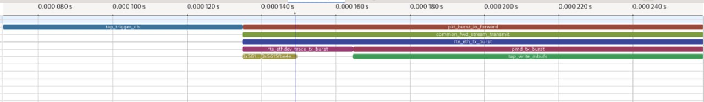
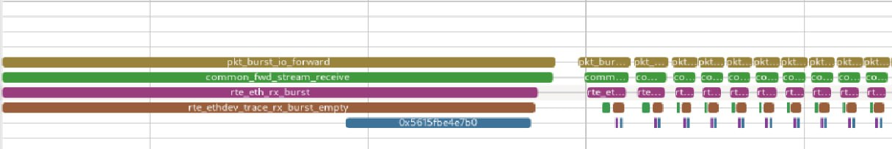
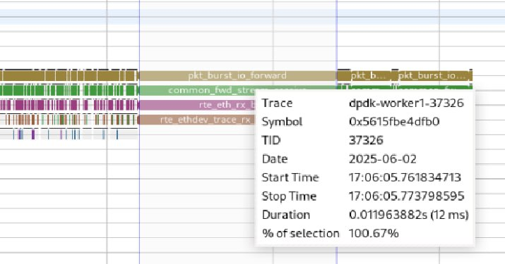
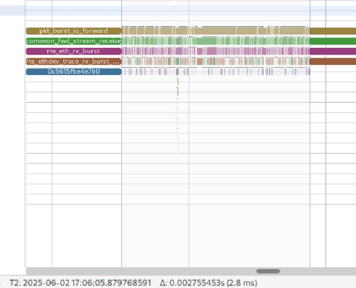
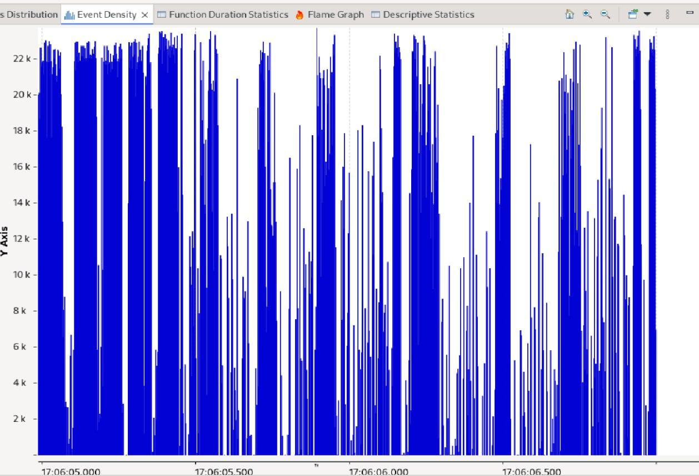
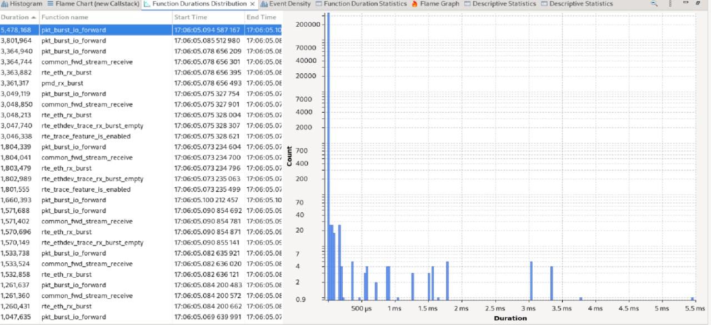
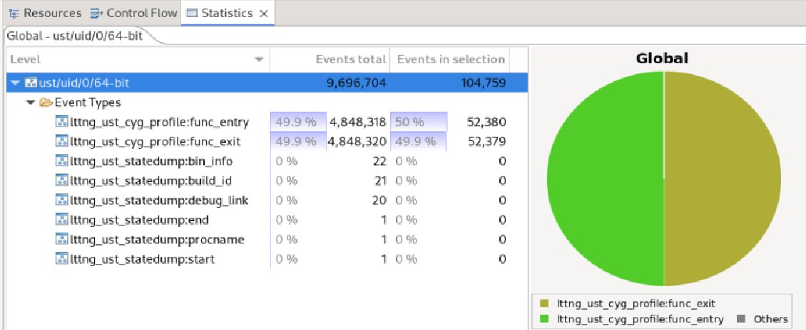
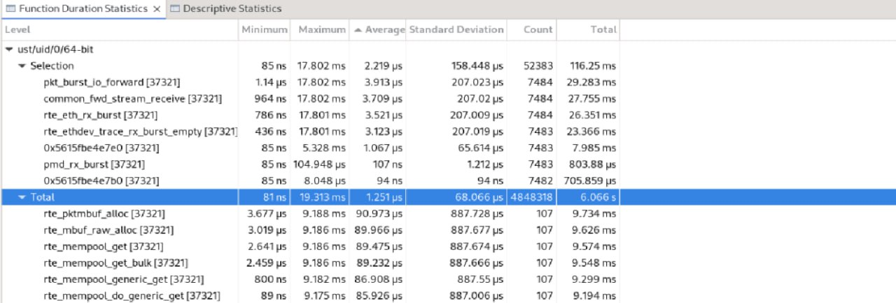
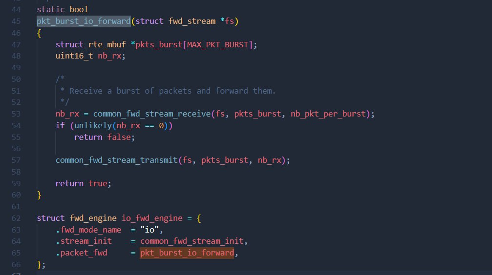
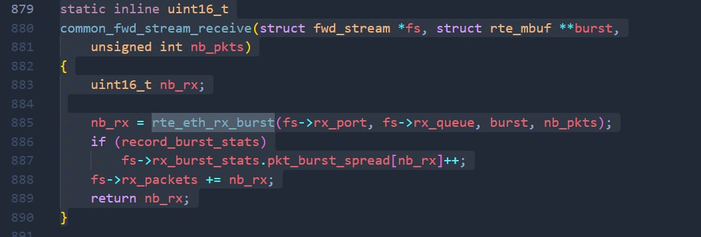

# Tracing DPDK operation while using PCAP as the input traffic 


## Introduction

### Purpose
The goal here is to replay the crafted or captured flow of network data to DPDK for testing and debugging purposes. Moreover, you can see the operation of this entity under different configurations or different rate of incomming loads. In the end, we have traced DPDK using LTTng to explore what's going on under the hood when we inject the stored network traffic to the DPDK.

### Setup
For this project just like the previous one, we have used LTTng and DPDK and again we have built DPDK with the options that are necessary for the purposes of this project. You can see the commands and additional information about the commands used in this project you can refer to the provided links to [DPDK documentation](https://doc.dpdk.org/guides/nics/pcap_ring.html).

```bash
# DPDK side
sudo ./build/app/dpdk-testpmd -l 4-7 -n 2 --vdev=net_tap0 iface=tap0 --vdev=net_tap1,iface=tap1 -- -i
```

```bash
# Tcpreplay side
sudo tcpreplay -i tap0 --loop=1000 test.pcap
```

## Analysis

### Flame Chart and Flame Graph
We have used "TAP" as our virtual network interface for injecting our PCAP file to DPDK. When we run an application like "testpmd" or "vhost-user," the input and output packets should be transfered using TAP file descriptor.

<center>



</center>

* The job of "tap_trigger_cb" specifically is usually one of two things: When the application has a packet to send, 
"tap_trigger_cb" may be fired in response to a poll or notification to take it from the buffer and write it to the TAP file descriptor (as if the card had been sent to the virtual network).

* On the receive (RX) path:
When the TAP says there is data to read, "tap_trigger_cb" is called.
This function reads packets from the TAP file descriptor and sends them to the processing loop (e.g. to "rte_eth_rx_burst" to simulate a receive). 
  - common_fwd_stream_receive
  - rte_eth_rx_burst
  - pmd_rx_burst
  - rte_net_get_ptype
  - rte_pktmbuf_read

  These functions are related to receiving packets from the NIC (or TAP).

* pkt_burst_io_forward ← The main path that takes the packet from RX and prepares it for transmission. This function in testpmd is designed to transmit packets in forward mode. When testpmd is operating in forward mode , packets received from a port need to be sent to another port — and this function is responsible for transmitting those packets.


* TX path:
  - common_fwd_stream_transmit
  - rte_eth_tx_burst
  - pmd_tx_burst
  - tap_write_mbufs

  These functions are responsible for sending packets to the TAP or NIC.

* Freeing memory (Free mbufs). After sending:
  - rte_pktmbuf_free
  - rte_pktmbuf_free_seg
  - rte_mbuf_raw_free
  - rte_mempool_put
  - rte_mempool_put_bulk

  These show that the packets that were sent were freed from memory.

### Function Duration Statistics:
<center>


</center>

* These functions are all related to memory management and data copying. A lot of processing time is spent getting/returning mbuf and memcpy. Memory pool management is heavy on system; probably because insufficient local caches or using small bulks. 

* Data copying is also heavy. Cause we use TAP, this is normal because it requires transferring between kernel and user space.

* rte_eth_rx_burst it will ends quickly so it's not our bottleneck.

So, our bottleneck is not in NIC, in fact it is in memory management and copying data. 

<center>


</center>

Receive takes a long time, but transmit is fast:
*  RX is Polling or waiting for a packet. If the NIC or driver does not send a packet, the receive must wait.
rte_eth_rx_burst() may try several times to return a packet (poll loop).

* TAP interface is slow (especially in VM or software)
If packets come from tap0 or tap1, kernel-space may introduce a lot of latency.
This will cause the packet to take longer than expected to receive.

* Latency from the peer (the program that generates the packet)
If the peer does not send the packet on time (for example, the other program is slow), you will be stuck on receive.

<center>


</center>

Inside rte_eth_rx_burst, more time is spent on rte_ethdev_trace_rx_burst_empty than pmd_rx_burst

rte_ethdev_trace_rx_burst_empty is a tracepoint or marker, which is called when rte_eth_rx_burst receives no packets (0 packets). That is:

This marker is activated every time RX polling is done but the NIC buffer is empty.

A lot of time in rte_ethdev_trace_rx_burst_empty is a sign that polling has been done many times but no packets have been received.

This means:

pmd_rx_burst didn't really do anything special, it just checked and said "nothing."
So CPU time is wasted on useless polling.

why it happens, what does it means:

* more than enough core for low input

* Packets are not arriving from TAP.

<center>



</center>

the app alternates between:

* Idle/polling loops (with no packet)

* Active loops (where actual packet processing happens)

most of our time is spent in the rte_ethdev_trace_rx_burst_empty path, it means you’re polling too frequently without actual traffic.

This leads to:

* Wasted CPU cycles

* Inefficient energy usage

* Possibly higher latency

<center>


*Measuring the idle time is 12 ms*



*Measuring the packet sending and receiving  time is 2.8 ms*

</center>

### Event Density
The activity is not smooth — you see dense regions followed by near-zero activity.

This supports your earlier observation: the application alternates between active and idle states

<center>



</center>

1. Bursty Behavior: The activity is not smooth — you see dense regions followed by near-zero activity. This supports your earlier observation: the application alternates between active and idle states (e.g., successful vs empty rte_eth_rx_burst calls).

2. High-Frequency Bursts: The tall clusters probably correspond to packet bursts being received and processed. When there's actual packet arrival, lots of function calls and subcalls happen, creating a high event density.

3. Idle Gaps: White vertical areas (or very low spikes) suggest few or no significant function calls — likely waiting or polling with no work (e.g., empty RX burst returns).

To optimize performance:
 * Use rx batching to reduce the cost of each call.
 * In low-load conditions, also consider the interrupt-based model.

### Function Duration Distribution

<center>



</center>

Frequent functions with long execution times:
* pkt_burst_io_forward
* rte_eth_rx_burst
* rte_ethdev_trace_rx_burst_empty
* rte_trace_feature_is_enabled

**Identifying performance bottlenecks:**
Functions like rte_ethdev_trace_rx_burst_empty that take a long time may be due to:
* Idleness (polling without receiving a packet)
* Problems in TAP drivers or operating system interrupts

**Checking the effectiveness of Tracing:** The rte_trace_feature_is_enabled and rte_ethdev_trace_rx_burst_empty functions are present and are time-consuming. If tracing is disabled or reduced, latency may be reduced.

**Identify jitter or fluctuations:** The presence of functions with times much higher than the average (e.g. >3ms) indicates jitter in the processing behavior. This is important in real-time or high-performance systems and it is necessary to investigate why the delay is sometimes so high.

**For better performance:**
* Turn off LD_PRELOAD or remove feature tracing
* Ring/mempool optimization because functions like rte_eth_rx_burst are heavily dependent on mempool settings.

### Statistics

<center>



</center>

Capture a function-level profiling session, most likely to analyze performance or CPU usage over time. The data shows that our application (testpmd with tap0 and tap1) spent its time fairly evenly entering and exiting functions — typical for a heavily iterative or loop-driven application like testpmd.

### Function Duration Statistics

<center>



</center>

The dominant function is pkt_burst_io_forward:

<center>



</center>

MAX_PKT_BURST is the number of packets that can be received in a burst.

This array is used to store received packets.
uint16_t nb_rx;

Keeps track of the number of packets received.


1. Receiving packages:
nb_rx = common_fwd_stream_receive(fs, pkts_burst, nb_pkt_per_burst);


2. Checking package receipt:
if (unlikely(nb_rx == 0))
    return false;

3. Sending packages:
common_fwd_stream_transmit(fs, pkts_burst, nb_rx);

<center>



</center>

nb_rx = rte_eth_rx_burst (fs->rx_port, fs->rx_queue, burst, nb_pkts);

It tries to receive up to nb_pkts packets from the specified port and queue (fs->rx_port and fs->rx_queue).

The packets are placed in the burst array.

The actual number of packets received is stored in nb_rx.

The role of rte_eth_rx_burst here:
This is the function that actually takes the data from the RX queue of the network card.
